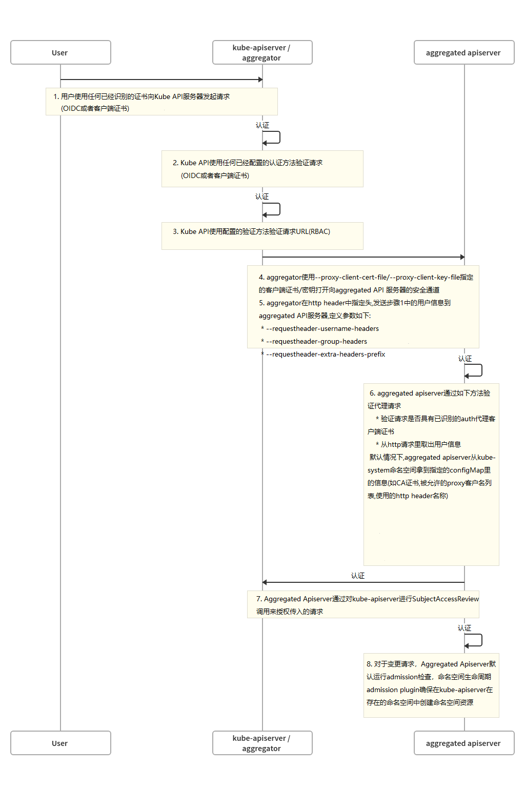

# 配置 Aggregation Layer

配置 `Aggregation Layer`允许使用其他API拓展`kubernetes apiserver`,即便这些`api`并非是`kubernetes API`的核心`API`部分.

- [在开始之前](#在开始之前)
- [认证流程](#认证流程)
- [启用Kubernetes Apiserver flags](#启用Kubernetes Apiserver flags)

# 在开始之前

你需要一个`kubernetes`集群,并且能够正常使用`kubectl`命令行工具操作该集群,如果你没有准备好的集群,你可以使用[Minikube](https://kubernetes.io/docs/setup/minikube)部署,当然你也可以使用如下方式进行测试:

- [Katacoda](https://www.katacoda.com/courses/kubernetes/playground)
- [Play with Kubernetes](http://labs.play-with-k8s.com/)

检查集群版本,输入`kubectl version`.

`Note: 在你的环境里配置proxy和extension apiservers间使用双向TLS( mutual TLS)认证时,有一定配置要求:kubernetes和kube-apiserver需要有多个CA证书,这是为了确保proxy是使用Aggregation Layer的CA证书而非其他,例如master的CA证书`

警告: 对不同类型的客户端重用相同的CA会对集群的运行能力产生负面影响,从[CA Reusage and Conflicts](https://kubernetes.io/docs/tasks/access-kubernetes-api/configure-aggregation-layer/#ca-reusage-and-conflicts)这里获取更多信息

# 认证流程

不同于Custom Resource Definitions (CRDs), 在你的集群中,除了标准的`kubernetes apiserver`之外,`Aggregation API`还设计另外一台服务器,即你的`Extension apiserver`(例如`metrics-server`),`kubernetes  apiserver`与`extension apiserver`双向交互,为了确保安全的交互,`kubernetes apiserver`使用`X509`证书认证其自身与`extension apiserver`的连接.

本节介绍身份验证以及授权流程的工作方式,并如何配置他们.

高级流程如下:

1. `kube-apiserver:` 对请求的User进行身份验证并授权他们所请求的路径;
2. `kube-apiserver:` 代理请求到`extension server`;
3. `Extension apiserver: ` 认证来自`kube-apiserver`的请求;
4. `Extension apiserver: ` 认证原始用户的请求
5. `Extension apiserver: ` 执行

本节的其余部分将详细介绍这些步骤.

流程图如下所示



## Kubernetes Apiserver认证和授权

对`extension apiserver`提供的服务请求路径与其他API请求的方式相同: 与`kubernetes apiserver`交互,并且`extension apiserver`提供的该路径已经注册到`kubernetes apiserver`.

User与`kubernetes apiserver`交互,需要被允许访问该路径,`kubernetes apiserver`使用标准身份验证与授权规则来验证用于与组织访问特定路径.

有关`kubernetes`集群身份验证的概述,请参考[“Authenticating to a Cluster”](https://kubernetes.io/docs/reference/access-authn-authz/authentication/). 有关`kubernetes`集群资源授权的概述,请参阅[“Authorization Overview”](https://kubernetes.io/docs/reference/access-authn-authz/authorization/).

到目前为止,一切都是标准的`kubernetes API`请求,身份验证与授权.

`kubernetes apiserver`现在准备将请求发送到`extension apiserver`

## Kubernetes Apiserver代理请求

现在`kubernetes apiserver`将会发送或者代理请求到已经注册的`extension apiserver`处理该请求.为了做到这一点,它需要知道几件事:

1. `kubernetes apiserver`向`extension apiserver`进行身份验证,通知`extension apiserver`该请求来自有效的`kubernetes apiserver`.
2. `kubernetes apiserver`如何通知`extension apiserver`原始请求的username和group已经通过验证

为了解决如上两项,你必须配置`kubernetes apiserver`的一些参数

##  kubernetes Apiserver客户端证书

`kubernetes apiserver`通过TLS加密连接到`extension apiserver` ,使用客户端证书对自己进行验证,你必须在`kubernetes apiserver`启动时提供如下参数:

- 使用参数`--proxy-client-key-file`提供私钥文件
- 使用参数`--proxy-client-cert-file`提供客户登入证书文件
- 使用参数`--requestheader-client-ca-file`提供客户登入CA证书文件
- 使用参数`--requestheader-allowed-names`提供在客户登入证书中有效的Common Names (CN字段) 

`kubernetes apiserver`将使用`--proxy-client-*-file`认证`extension server`,为了使一个请求通过一个兼容的`extension apiserver`被认为是有效的,必须满足如下条件:

1. 该连接必须使用CA证书(`--requestheader-client-ca-file`提供的证书文件)签发的客户端证书登入
2. 该连接使用的客户端证书`CN`字段必须列在`--requestheader-allowed-names`内.**Note**:你可以设置该参数为空`--requestheader-allowed-names=""`,此表示所有的`CN`将被允许

当使用这些参数启动时`kubernetes apiserver`将:

1. 使用这些参数验证`extension apiserver`
2. 在`kube-system`命名空间创建名称为`extension-apiserver-authentication`的`configMap`,起内容包含了CA证书,以及被允许的CN列表,这些信息将被`extension apiserver`使用来验证请求

**Note**: `kubernetes apiserver`使用相同的哭护短证书验证所有的`extension apiserver`,它不会对每个`extension apiserver`创建客户端证书,相当于某一个证书用于验证`kubernetes apiserver`,那么将被重用与所有的`extension apiserver`.


## 原始请求的Username和Group

当`kubernetes apiserver`代理请求到`extension apiserver`时,`kubernetes apiserver`通知`extension apiserver`原始请求的username和group被允许,他们将被提供在代理请求的 `header`里,你必须告诉`kubernetes apiserver`相应的header名称

- `--requestheader-username-headers`参数提供的header名被使用作为提供username
- `--requestheader-group-headers`参数提供的header名被作为提供group
- `--requestheader-extra-headers-prefix`参数提供其他额外的header名称

这些header名称都将被存储在名为`extension-apiserver-authentication`的`configMap里`,这些信息可以被`extension-apiserver`检索和使用

## Extension Apiserver验证请求

`extension apiserver`接收到`kubernetes apiserver`代理过来的请求,必须验证请求是否来自有效的身份验证代理,`kubernetes apiserver`正在履行哪个角色,`extension apiserver`将通过如下步骤

1. 从`kube-system`命名空间的`extension-apiserver-authentication`内取出如下字段:

- 客户端CA证书
- 被允许的名称(CN)列表
- username和group的header名称,以及其他额外的header名

2. 检查TLS请求使用的客户端证书

- 被`configMap`中检索到的CA证书签名
- CN被`configMap`中检索到的的CN列表包含
- 从header中提取相应的`username`和`group`

如果上面的都通过,那么请求被认为有效,并且是来自合法身份的验证代理服务器,在本例中,验证代理服务器为`kubernetes apiserver`

**Note**:  如上行为是`extension apiserver`利用利用`k8s.io/apiserver/`包的默认操作,其他人可能会用命令行选项覆盖它

为了使`extension apiserver`能够在`kube-system`的`configMap`中检索数据,在`kube-system`有一个名为`extension-apiserver-authentication-reader`的`role`可以被使用

## Extension Apiserver授权请求

`extension apiserver`现在可以验证来自请求中的`user/group`,它通过向`Kubernetes apiserver`发送标准[SubjectAccessReview](https://kubernetes.io/docs/reference/access-authn-authz/authorization/) 请求来实现。

为了使`extension apiserver`能够将自己的`SubjectAccessReview`请求提交给`kubernetes apiserver`，其需要正确的权限,`kubernetes`提供了一个名为`system:auth-delegator`的`ClusterRole`,其具有适当的权限,可以被授予`extension apiserver`使用的`service account`

## Extension Apiserver执行

如果`SubjectAccessReview`通过,`extension apiserver`执行该请求


# 启用Kubernetes Apiserver flags

通过添加如下`kube-apiserver`参数以启用`aggregation layer`,他们可能已经由你的提供商处理

```bash
--requestheader-client-ca-file=<path to aggregator CA cert>
--requestheader-allowed-names=front-proxy-client
--requestheader-extra-headers-prefix=X-Remote-Extra-
--requestheader-group-headers=X-Remote-Group
--requestheader-username-headers=X-Remote-User
--proxy-client-cert-file=<path to aggregator proxy cert>
--proxy-client-key-file=<path to aggregator proxy key>
```

## CA复用以及冲突

`kubernetes apiserver`有如下2个客户端CA参数:

- `--client-ca-file`
- `--requestheader-client-ca-file`

如果使用不正确,这些功能中的每一个都可能冲突:

- `--client-ca-file`: 当请求到达`kubernetes apiserver`,如果该参数被使用,`kubernetes apiserver`检查请求证书,如果登入证书被`--client-ca-file`参数中提供的额证书签名,请求被视为合法请求,并且User为`common name`的值CN=,而`group`是`organization `的值O=, [点此查看TLS文档](https://kubernetes.io/docs/reference/access-authn-authz/authentication/#x509-client-certs).
- `--requestheader-client-ca-file`: 当请求到达`kubernetes apiserver`,如果该参数被使用,`kubernetes apiserver`将检查该请求的证书,如果登入证书由`--requestheader-client-ca-file`指定的证书签发,那么请求被认为合法,`kubernetes apiserver`检查证书的`common name` `CN=`存在于`--requestheader-allowed-names`列表,如果该用户被允许,该请求被通过,否则不通过

如果`--client-ca-file` 和`--requestheader-client-ca-file` 都提供了相应得CA文件,请求将第一个请求`--requestheader-client-ca-file`,然后再检查`--client-ca-file` ,一般情况下,不同的CA根CA以及中间CA,用于选项中的每一个,常规请求与`--client-ca-file`提供的CA匹配,`aggregation `请求匹配`--requestheader-client-ca-file`提供的CA,,然而,如果他们提供的CA相同,那么常规会通过`--client-ca-file`传递的客户端请求将失败,因为将会匹配`--requestheader-client-ca-file`提供的CA,但是 common name `CN=` 将不会匹配到`--requestheader-allowed-names`允许的列表,这可能直接影响到你的`kubelet`,其他控制组件以及最终用户,将无法`向kubernetes apiserver`进行身份验证,为此为`--client-ca-file`使用不同的CA,来授权控制平面组件和最终用户,使用`--requestheader-client-ca-file`选项提供的CA,授权聚合`apiserver`请求.

**警告**: 除非您了解保护CA使用的风险和机制，否则请勿在上下文中使用重复的CA.

如果没有在节点上运行`kube-apiserver`,那么你必须在`kube-apiserver`中添加如下启动参数

```bash
--enable-aggregator-routing=true
```

