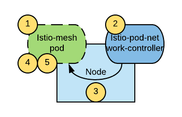

原文来自 *[通过消除对特权容器的需求来提高Istio部署的安全性](https://blog.openshift.com/increasing-security-of-istio-deployments-by-removing-the-need-for-privileged-containers/)*

随着[1.0的发布](https://istio.io/blog/2018/announcing-1.0/)，Istio正在为开发容器应用并希望采用服务网格解决方案的公司做好准备。但是，存在一些可能降低采用率的潜在问题:：属于Istio网格的Pod需要提升权限才能正常运行。在本文中，我们将介绍[istio-pod-network-controller](https://github.com/sabre1041/istio-pod-network-controller)，这是一个能缓解此问题的解决方案（译者，解决方案也存在相应的问题，后面会提到）

#### 问题

作为服务网格的正常操作的一部分，Istio需要操作pod的[iptables](https://en.wikipedia.org/wiki/Iptables)规则，以拦截与相应容器的连接并注入Istio，这使得Istio极为强大，iptables规则存在于相应的[网络命名空间](http://man7.org/linux/man-pages/man7/network_namespaces.7.html)，因此在pod中进行的iptables更改，不会影响其他pod或者运行pod的节点。

[init容器](https://kubernetes.io/docs/concepts/workloads/pods/init-containers/)是Istio的一部分，负责在启动主要容器集之前添加相应的iptables规则，操作iptables规则需要通过[*NET_ADMIN*](http://man7.org/linux/man-pages/man7/capabilities.7.html)功能提升访问权限操作。*NET_ADMIN*是一种内核功能（可以想象）允许您重新配置Linux机器的网络。这意味着具有该功能的pod不仅可以将自身添加到Istio网格中，还可以开始干扰其他pod的网络配置以及节点本身。通常，不建议在共享租户群集中具有具有该功能的应用程序窗格。

OpenShift提供了一种通过称为[安全上下文（SCC）](https://docs.openshift.com/container-platform/3.10/admin_guide/manage_scc.html)的机制来控制pod可以拥有的权限（在本例中为内核功能）的方法。允许正常运行Istio的唯一开箱即用的SCC配置文件是*privileged*配置文件。为了将命名空间中的pod添加到Istio服务网格，必须执行以下命令才能访问privileged  SCC：

```
oc adm policy add-scc-to-user privileged -z default -n < target-namespace >
```

本质上，已经为此命名空间中的所有pod提供了root访问权限，并且由于运行普通应用程序时的安全隐患，因此通常不建议使用root访问权限。

虽然这个问题一直存在于Istio社区的人们的脑海中，但直到最近，Kubernetes还没有一种机制来控制对pod的权限。从[Kubernetes 1.11](https://github.com/kubernetes/kubernetes/blob/master/CHANGELOG-1.11.md)开始，[Pod安全策略（PSP）](https://kubernetes.io/docs/concepts/policy/pod-security-policy/)  功能已作为测试版功能引入。PSP以与SCC类似的方式运行。一旦其他Kubernetes发行版开始支持开箱即用的PSP，很明显，Istio网格中的pod需要（太需要）提升权限才能正常运行。

### 解决方案

缓解此问题的一种方法是将配置pod的iptables规则的逻辑移出pod本身。

其结果是[DaemonSet](https://kubernetes.io/docs/concepts/workloads/controllers/daemonset/)控制器，称为istio-POD-network-controller，监视新pod的创建，并在创建后立即在这些新pod中配置相应的iptables规则。下图描绘了解决方案的整体架构：



流程如下：

1. 将创建一个新pod
2. 部署在创建容器的节点上的istio-pod-network-controller确定新容器是否应属于Istio网格，因此必须初始化
3. 如果是，则istio-pod-network-controller初始化新pod的iptables规则，并通过注释将pod标记为初始化。
4. pod中的init容器等待初始化注释出现，确保应用程序容器和[sidecar](https://istio.io/docs/setup/kubernetes/sidecar-injection/) Envoy代理仅在iptables初始化完成后启动
5. sidecar容器和应用容器启动。

有了这个解决方案，在Istio网格中运行的吊舱只需要访问nonroot SCC。该nonroot  SCC是由于特使边车需要用特定的非root用户ID来运行的需要。

理想情况下，希望Istio应用程序与受限 SCC 一起运行，这是OpenShift中的默认值。尽管如此，nonroot  SCC只是在*限制范围内*的边缘放松，并且通常是可接受的折衷。无论如何，与要求使用privileged SCC 运行每个Istio应用程序的pod相比，这是一个巨大的进步。

相反，istio-pod-network-controller利用privileged 配置文件和*NET_ADMIN*功能来修改其他pod的iptables规则。这通常是可接受的解决方案，因为该组件将由集群管理员以与Istio控制平面类似的方式安装和管理。

### 安装说明

假设根据[安装指南](https://istio.io/docs/setup/kubernetes/)已成功将*Istio*安装在*istio-system*命名空间中，请克隆[repo](https://github.com/sabre1041/istio-pod-network-controller)，然后执行以下命令以使用Helm 安装istio-pod-network-controller ：

```
$ helm template -n istio-pod-network-controller --set kubernetesDistribution=OpenShift ./chart/istio-pod-network-controller | oc apply -f -
```

有关其他部署方案，请参阅[istio-pod-network-controller GitHub仓库的说明](https://github.com/sabre1041/istio-pod-network-controller)

在同一个仓库中，您还可以找到测试istio-pod-network-controller的说明已正确部署。

### 结论

istio-pod-network-controller是一个使Istio部署更安全的选项。它通过消除使用*特权* SCC 在Istio网格中运行pod的需要并允许它们仅使用*非根* SCC 运行。如果您决定采用此解决方案，请记住，这是一个尽力而为的项目，而不是Red Hat正式支持。

PS:  在译者测试过程中发现一些问题,比如egress白名单注释: traffic.sidecar.istio.io/excludeOutboundIPRanges=0.0.0.0/0在原生init容器中能正确放行所有出口流量,但是在[istio-pod-network-controller](https://github.com/sabre1041/istio-pod-network-controller)中不能正确被识别,即便是在[istio-pod-network-controller](https://github.com/sabre1041/istio-pod-network-controller)已经挂载的配置文件中存在相应的配置,后续关注详见 [issue #18](**https://github.com/sabre1041/istio-pod-network-controller/issues/18**)

