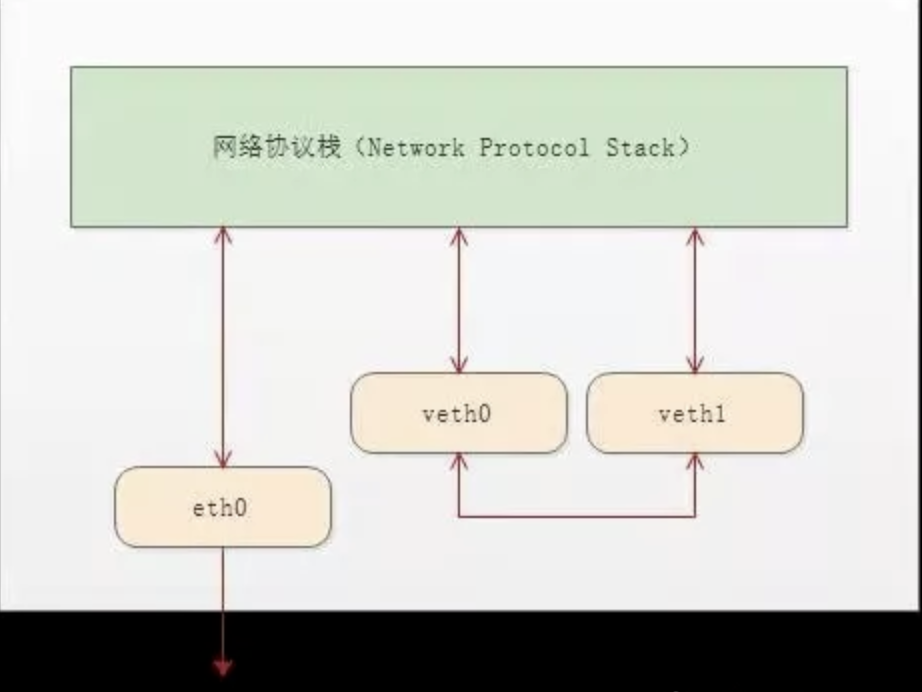
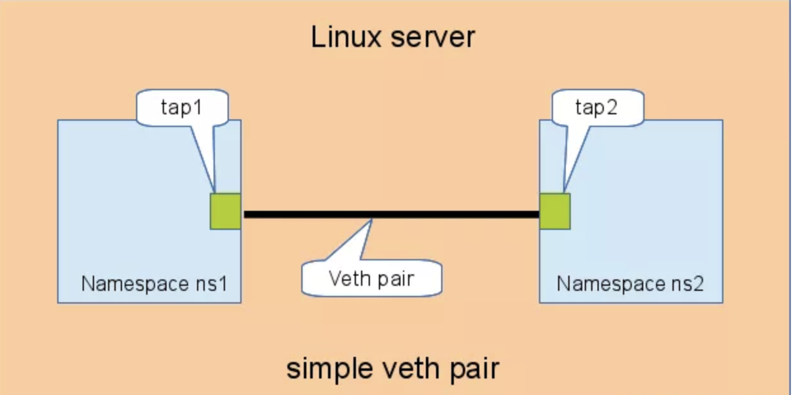
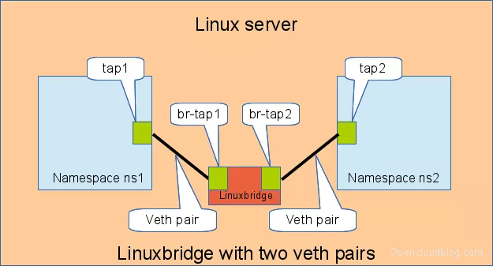

聊聊linux里的veth pair以及应用

#### veth-pair是什么

veth-pair中文释义虚拟网卡对,看名字就知道,他是成对出现的,并且是一种虚拟设备.veth-pair一端总是连着彼此,另一段连着网络协议栈.



因为这种联通特性,veth-pair往往充当一种桥梁.典型的例子就是两个namespace之间的连接(这也是我们这里主要讨论的),“Bridge、OVS 之间的连接”等.

#### veth-pair的连通性

 ##### 直接相连

直接相连是最简单的方式，如下图，一对 veth-pair 直接将两个 namespace 连接在一起。



在做测试之前的准备工作

1. 创建2个namespace:

   ```
   [root@master ~]# ip netns add ns1
   [root@master ~]# ip netns add ns2
   [root@master ~]# ip netns list
   ns2
   ns1
   ```

2. 创建veth pair

   ```
   [root@master ~]# ip link add tap1 type veth peer name tap2
   [root@master ~]# ip a
   ###查看host上所有网络设备,可以看到veth-pair总是指向对方
   33: tap2@tap1: <BROADCAST,MULTICAST,M-DOWN> mtu 1500 qdisc noop state DOWN group default qlen 1000
       link/ether e6:2a:a8:bf:69:9f brd ff:ff:ff:ff:ff:ff
   34: tap1@tap2: <BROADCAST,MULTICAST,M-DOWN> mtu 1500 qdisc noop state DOWN group default qlen 1000
       link/ether ba:be:4b:61:d2:bc brd ff:ff:ff:ff:ff:ff
   ```

3. 将veth-pair的一头插进namespace

   ```
   [root@master ~]# ip link set tap1 netns ns1
   [root@master ~]# ip link set tap2 netns ns2
   
   ```

   再次查看host上的网络设备,发现veth-pair已经消失

4. 我们进入两个ns里查看对应的网络设备

   ```
   [root@master ~]# ip netns exec ns1 ip a
   1: lo: <LOOPBACK> mtu 65536 qdisc noop state DOWN group default qlen 1000
       link/loopback 00:00:00:00:00:00 brd 00:00:00:00:00:00
   34: tap1@if33: <BROADCAST,MULTICAST> mtu 1500 qdisc noop state DOWN group default qlen 1000
       link/ether ba:be:4b:61:d2:bc brd ff:ff:ff:ff:ff:ff link-netnsid 1
   [root@master ~]# ip netns exec ns2 ip a
   1: lo: <LOOPBACK> mtu 65536 qdisc noop state DOWN group default qlen 1000
       link/loopback 00:00:00:00:00:00 brd 00:00:00:00:00:00
   33: tap2@if34: <BROADCAST,MULTICAST> mtu 1500 qdisc noop state DOWN group default qlen 1000
       link/ether e6:2a:a8:bf:69:9f brd ff:ff:ff:ff:ff:ff link-netnsid 0
   ```

   可以发现目前网络设备上是没有绑定ip的,所以下一步我们需要给网络设备添加ip

5. 给网络设备添加ip

   ```
   [root@master ~]# ip netns exec ns1 ip addr add local 192.168.10.200/24 dev tap1
   [root@master ~]# ip netns exec ns2 ip addr add local 192.168.10.201/24 dev tap2
   ```

   再次查看2个namespace里的设备ip

   ```
   [root@master ~]# ip netns exec ns1 ip a
   1: lo: <LOOPBACK> mtu 65536 qdisc noop state DOWN group default qlen 1000
       link/loopback 00:00:00:00:00:00 brd 00:00:00:00:00:00
   34: tap1@if33: <BROADCAST,MULTICAST> mtu 1500 qdisc noop state DOWN group default qlen 1000
       link/ether ba:be:4b:61:d2:bc brd ff:ff:ff:ff:ff:ff link-netnsid 1
       inet 192.168.10.200/24 scope global tap1
          valid_lft forever preferred_lft forever
   [root@master ~]# ip netns exec ns2 ip a
   1: lo: <LOOPBACK> mtu 65536 qdisc noop state DOWN group default qlen 1000
       link/loopback 00:00:00:00:00:00 brd 00:00:00:00:00:00
   33: tap2@if34: <BROADCAST,MULTICAST> mtu 1500 qdisc noop state DOWN group default qlen 1000
       link/ether e6:2a:a8:bf:69:9f brd ff:ff:ff:ff:ff:ff link-netnsid 0
       inet 192.168.10.201/24 scope global tap2
          valid_lft forever preferred_lft forever
   ```

6. 我们在ns1里直接ping ns2设备上的ip

   启动设备

   ```
   [root@master ~]# ip netns exec ns1 ifconfig tap1 up
   [root@master ~]# ip netns exec ns2 ifconfig tap2 up
   ```

   ping测试,我们发现ping测试已经正常

   ```
   [root@master ~]# ip netns exec ns1  ping 192.168.10.201
   PING 192.168.10.201 (192.168.10.201) 56(84) bytes of data.
   64 bytes from 192.168.10.201: icmp_seq=1 ttl=64 time=0.059 ms
   64 bytes from 192.168.10.201: icmp_seq=2 ttl=64 time=0.058 ms
   ^C
   --- 192.168.10.201 ping statistics ---
   2 packets transmitted, 2 received, 0% packet loss, time 999ms
   rtt min/avg/max/mdev = 0.058/0.058/0.059/0.007 ms
   [root@master ~]# ip netns exec ns2  ping 192.168.10.200
   PING 192.168.10.200 (192.168.10.200) 56(84) bytes of data.
   64 bytes from 192.168.10.200: icmp_seq=1 ttl=64 time=0.092 ms
   64 bytes from 192.168.10.200: icmp_seq=2 ttl=64 time=0.061 ms
   ^C
   --- 192.168.10.200 ping statistics ---
   2 packets transmitted, 2 received, 0% packet loss, time 999ms
   rtt min/avg/max/mdev = 0.061/0.076/0.092/0.017 ms
   ```

##### 通过Bridge连接

 Linux Bridge 相当于一台交换机，可以中转两个 namespace 的流量，我们看看 veth-pair 在其中扮演什么角色。

如下图，两对 veth-pair 分别将两个 namespace 连到 Bridge 上。



准备工作

```
#创建bridge

[root@master ~]# ip l a br0 type bridge
[root@master ~]# brctl show
bridge name	bridge id		STP enabled	interfaces
br0		8000.000000000000	no
#启动br0设备
[root@master ~]# ip l s br0 up

#创建2对veth-pair 为什么需要2对,因为每队都有一头是绑定在虚拟网桥上的,所有2个namespace的通信,需要2对veth-pair
[root@master ~]# ip l a veth100 type veth peer name br-veth100
[root@master ~]# ip l a veth101 type veth peer name br-veth101

#创建2个namespace
[root@master ~]# ip netns add ns100
[root@master ~]# ip netns add ns101
#将2对veth-pair的一头绑定到网桥上,并设置状态为up
[root@master ~]# ip l s br-veth100 master br0
[root@master ~]# ip l s br-veth100 up
[root@master ~]# ip l s br-veth101 master br0
[root@master ~]# ip l s br-veth101 up
### 查看网桥
[root@master ~]# brctl  show
bridge name	bridge id		STP enabled	interfaces
br0		8000.4699defb1d05	no		br-veth100
							                br-veth101
							                
####将veth-pair剩下的一头插进各自的namespace
[root@master ~]# ip l s veth100 netns ns100
[root@master ~]# ip l s veth101 netns ns101
# 给两个 namespace 中的 veth 配置 IP 并启用

[root@master ~]# ip netns exec ns100 ip a a 192.168.1.100/24 dev veth100
[root@master ~]# ip netns exec ns100 ip l s veth100 up
[root@master ~]# ip netns exec ns101 ip a a 192.168.1.101/24 dev veth101
[root@master ~]# ip netns exec ns101 ip l s veth101 up
#查看两个namespace里的设备状态
[root@master ~]# ip netns exec ns100 ip a
1: lo: <LOOPBACK> mtu 65536 qdisc noop state DOWN group default qlen 1000
    link/loopback 00:00:00:00:00:00 brd 00:00:00:00:00:00
41: veth100@if40: <BROADCAST,MULTICAST,UP,LOWER_UP> mtu 1500 qdisc noqueue state UP group default qlen 1000
    link/ether 1a:6c:10:64:e2:f6 brd ff:ff:ff:ff:ff:ff link-netnsid 0
    inet 192.168.1.100/24 scope global veth100
       valid_lft forever preferred_lft forever
    inet6 fe80::186c:10ff:fe64:e2f6/64 scope link
       valid_lft forever preferred_lft forever
[root@master ~]# ip netns exec ns101 ip a
1: lo: <LOOPBACK> mtu 65536 qdisc noop state DOWN group default qlen 1000
    link/loopback 00:00:00:00:00:00 brd 00:00:00:00:00:00
43: veth101@if42: <BROADCAST,MULTICAST,UP,LOWER_UP> mtu 1500 qdisc noqueue state UP group default qlen 1000
    link/ether ee:5d:67:2c:7c:c1 brd ff:ff:ff:ff:ff:ff link-netnsid 0
    inet 192.168.1.101/24 scope global veth101
       valid_lft forever preferred_lft forever
    inet6 fe80::ec5d:67ff:fe2c:7cc1/64 scope link
       valid_lft forever preferred_lft forever
##通过ping相互测试

```


#### calico里的vxlan和flannel里的vxlan

##### flanneld

```
##进入pod查看网络设备,可以看到eth0指向了if32
# kubectl  exec -ti centos-7d6b559dd5-trcgw bash
[root@centos-7d6b559dd5-trcgw /]# ip a
1: lo: <LOOPBACK,UP,LOWER_UP> mtu 65536 qdisc noqueue state UNKNOWN group default qlen 1000
    link/loopback 00:00:00:00:00:00 brd 00:00:00:00:00:00
    inet 127.0.0.1/8 scope host lo
       valid_lft forever preferred_lft forever
    inet6 ::1/128 scope host
       valid_lft forever preferred_lft forever
3: eth0@if32: <BROADCAST,MULTICAST,UP,LOWER_UP> mtu 1450 qdisc noqueue state UP group default
    link/ether de:e8:f1:d9:a4:5b brd ff:ff:ff:ff:ff:ff link-netnsid 0
    inet 10.244.0.4/24 brd 10.244.0.255 scope global eth0
       valid_lft forever preferred_lft forever
    inet6 fe80::dce8:f1ff:fed9:a45b/64 scope link
       valid_lft forever preferred_lft forever
##查看容器路由信息,路由信息指向了10.244.0.1
[root@centos-7d6b559dd5-trcgw /]# ip route
default via 10.244.0.1 dev eth0
10.244.0.0/24 dev eth0 proto kernel scope link src 10.244.0.4
10.244.0.0/16 via 10.244.0.1 dev eth0

##在宿主机上查看10.244.0.1,发现是一个网桥设备,以及容器网桥的另一头
[root@master ~]# ip a
29: cni0: <BROADCAST,MULTICAST,UP,LOWER_UP> mtu 1450 qdisc noqueue state UP group default qlen 1000
    link/ether 66:45:fd:67:82:a7 brd ff:ff:ff:ff:ff:ff
    inet 10.244.0.1/24 brd 10.244.0.255 scope global cni0
       valid_lft forever preferred_lft forever
    inet6 fe80::6445:fdff:fe67:82a7/64 scope link
       valid_lft forever preferred_lft forever
32: veth6f848792@if3: <BROADCAST,MULTICAST,UP,LOWER_UP> mtu 1450 qdisc noqueue master cni0 state UP group default
    link/ether 2a:7e:4d:96:79:31 brd ff:ff:ff:ff:ff:ff link-netnsid 2
    inet6 fe80::287e:4dff:fe96:7931/64 scope link
       valid_lft forever preferred_lft forever
       
#### 查看网桥信息,可以看到网桥上的veth6f848792设备即时容器的veth-pair的另一个设备
[root@master ~]# brctl show  cni0
bridge name	bridge id		STP enabled	interfaces
cni0		8000.6645fd6782a7	no		veth19689916
							veth6f848792
							vethe44aab74
							
						
```

总结:  flanneld使用了网桥连接namespace,通过cni0,连接容器之前的通信.


##### calico:

```
###同样 我们现在容器里查看容器网络设备信息以及路由信息
[root@account-biz-front-5f6f788959-vkr7w app]# ip a
1: lo: <LOOPBACK,UP,LOWER_UP> mtu 65536 qdisc noqueue state UNKNOWN group default qlen 1000
    link/loopback 00:00:00:00:00:00 brd 00:00:00:00:00:00
    inet 127.0.0.1/8 scope host lo
       valid_lft forever preferred_lft forever
3: eth0@if19: <BROADCAST,MULTICAST,UP,LOWER_UP> mtu 1450 qdisc noqueue state UP group default
    link/ether 5a:56:51:f9:7b:89 brd ff:ff:ff:ff:ff:ff link-netnsid 0
    inet 10.240.188.122/32 brd 10.240.188.122 scope global eth0
       valid_lft forever preferred_lft forever
[root@account-biz-front-5f6f788959-vkr7w app]# ip route
default via 169.254.1.1 dev eth0
169.254.1.1 dev eth0 scope link

#可以看到我们eth0的另一个设备指向if19,路由指向169.254.1.1 ,但是169.254.1.1是一个保留地址,那么路由是如何到达veth-pair的另一头的呢
#查看arp 表,发现169.254.1.1指向了ee:ee:ee:ee:ee:ee这个地址
[root@account-biz-front-5f6f788959-vkr7w app]# ip ne
10.4.0.22 dev eth0 lladdr ee:ee:ee:ee:ee:ee STALE
169.254.1.1 dev eth0 lladdr ee:ee:ee:ee:ee:ee REACHABLE
##现在回到我们的host上
#查看我们的veth-pair if19设备上
19: cali50c25257626@if3: <BROADCAST,MULTICAST,UP,LOWER_UP> mtu 1450 qdisc noqueue state UP group default
    link/ether ee:ee:ee:ee:ee:ee brd ff:ff:ff:ff:ff:ff link-netnsid 1
#在宿主机上查看路由表,我们发现了10.240.188.122这个路由信息 ,直接指向了veth-pair的host这一端
[root@dev-k8s-node2 ~]# ip route |grep cali50c25257626
10.240.188.122 dev cali50c25257626 scope link
#在查看arp表,
[root@dev-k8s-node2 ~]# arp -n |grep cali50c25257626
10.240.188.122           ether   5a:56:51:f9:7b:89   C                     cali50c25257626
#从上面的信息,我们可以看到,路由从宿主机上请求10.240.188.122时,经过路由信息,会直接把请求丢到cali50c25257626设备上,而cali50c25257626是 veth-pair其中的一个,另一头在容器里,这样流量就能从宿主机 到达容器里

```

总结: 

从上面可以看到,calico的模式,是一种直连模式,veth-pair的一头在容器里,另一头在host上,我们可以将host当作一个特殊的namespace,经过host的路由,请求可以到达host的其他容器上


参考文献:

*[https://cloud.tencent.com/developer/article/1432629](https://cloud.tencent.com/developer/article/1432629)*

