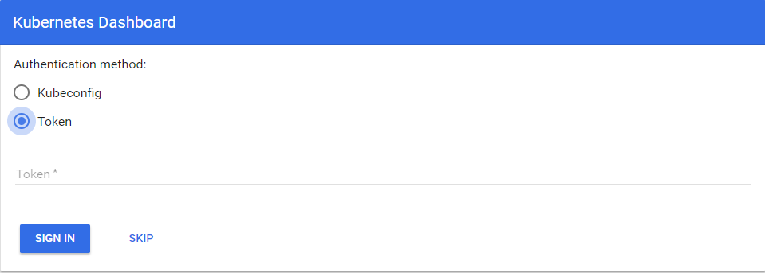

#### [跳转至下载链接](https://github.com/w564791/Kubernetes-Cluster/tree/master/dashboard)

直接使用命令创建dashboard

```
kubectl create -f .
```

#### 登录授权

上面的步骤中创建了一个全局admin的token和一个readonly的token，使用token登录dashboard

##### 使用token登录

```
[root@ip-10-10-6-201 k8s]# kubectl get secrets
NAME                               TYPE                                  DATA      AGE
admin-token-fv9lm                  kubernetes.io/service-account-token   3         38d
clustread-token-fdxpj              kubernetes.io/service-account-token   3         27d
default-token-tfdkb                kubernetes.io/service-account-token   3         39d
heapster-token-g8gxp               kubernetes.io/service-account-token   3         38d
kube-dns-token-vfp47               kubernetes.io/service-account-token   3         39d
kubernetes-dashboard-certs         Opaque                                2         38d
kubernetes-dashboard-key-holder    Opaque                                2         38d
kubernetes-dashboard-token-0t5t0   kubernetes.io/service-account-token   3         38d
[root@ip-10-10-6-201 k8s]# kubectl  describe secrets admin-token-fv9lm
Name:        admin-token-fv9lm
Namespace:    kube-system
Labels:        <none>
Annotations:    kubernetes.io/service-account.name=admin
        kubernetes.io/service-account.uid=6e350d69-cc54-11e7-9ced-0604ac83b36a

Type:    kubernetes.io/service-account-token

Data
====
ca.crt:        1359 bytes
namespace:    11 bytes
token:        .......
```

复制上文上省略号部分的内容到登录页上，即可登录，本文开启了nodePort 8443端口，使用集群中任意[https://IP:8443 ](https://IP:8443即可登录)即可登录



