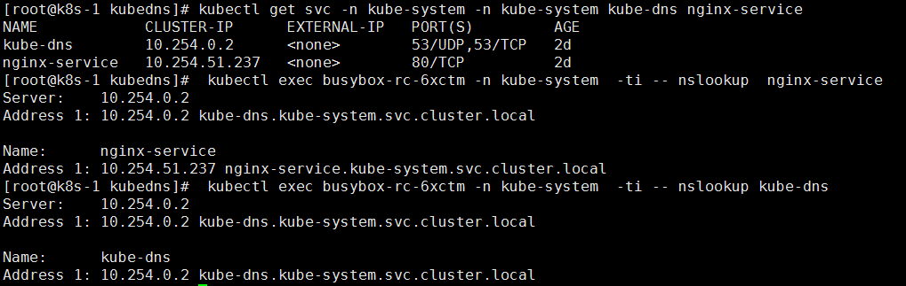

#### [跳转至yaml下载地址](https://github.com/w564791/Kubernetes-Cluster/tree/master/DNS)

#### 第1步 创建kubeconfig文件\(重要\)

注意事项:

1.需要将`kubeconfig`文件挂载至容器内部,本文的此文件路径为`/etc/kubeconfig/config`

```
#kubectl create cm kubeconfig --from-file=/root/.kube/config
```

3.`k8s-dns-kube-dns-amd64`容器启动时必须加`--kubecfg-file=/etc/kubernetes/config`参数

--kubecfg-file 参数说明:

```
 --kubecfg-file string Location of kubecfg file for access to kubernetes master service; --kube-master-url overrides the URL part of this;if this is not provided, defaults to service account tokens
```

#### 第二步 下载上面链接的yaml文件，执行如下命令

```
kubectl create -f .
```

last:效果图



##### 创建kubectl kubeconfig文件,此文件用于kubectl命令的 各项操作,

* 默认生成路径为~/.kube/config,_也可以用于dashboard,DNS的https认证,直接拷贝使用,我是直接拷贝到/etc/kubernetes/config2,然后挂载到容器里面作为dashboard的启动参数使用的. 如本文--kubecfg-file=/etc/kubernetes/config2_

```
export KUBE_APISERVER="https://xxxx" 
# 设置集群参数 
# kubectl config set-cluster kubernetes \
--certificate-authority=/etc/kubernetes/ssl/ca.pem \
--embed-certs=true \
--server=${KUBE_APISERVER} \
# 设置客户端认证参数
# kubectl config set-credentials admin \
--client-certificate=/etc/kubernetes/ssl/admin.pem \
--embed-certs=true \
--client-key=/etc/kubernetes/ssl/admin-key.pem
# 设置上下文参数
# kubectl config set-context kubernetes \
--cluster=kubernetes \
--user=admin
# 设置默认上下文
kubectl config use-context kubernetes
```


