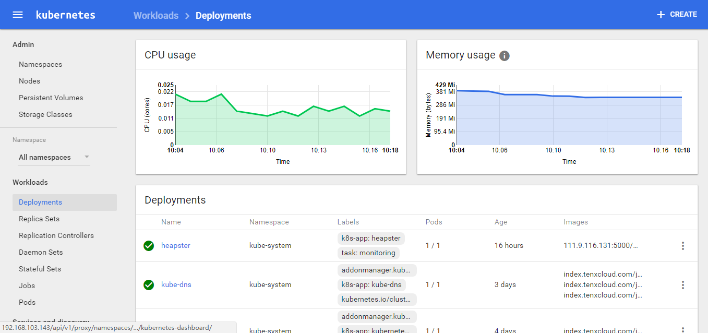
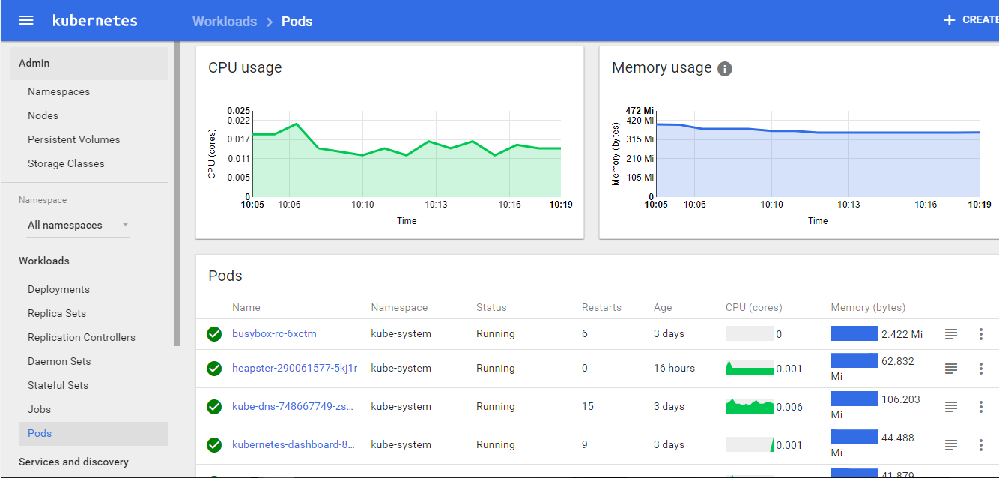

本处使用到的yaml文件,[跳转下载](https://github.com/w564791/Kubernetes-Cluster/tree/master/heapster)

## 配置 grafana-deployment

* heapster的grafana不需要了，后面部署Prometheus也会用Prometheus
* heapster官方已经弃用.请使用kube-metrics
* 本例使用[standalone](https://github.com/kubernetes/heapster/tree/master/deploy/kube-config/standalone)模式部署(没有influxdb)

## clone必要的文件

```
# git clone https://github.com/kubernetes/heapster.git
```

执行下面的文件

```
kind: ClusterRoleBinding
apiVersion: rbac.authorization.k8s.io/v1beta1
metadata:
  name: heapster
roleRef:
  apiGroup: rbac.authorization.k8s.io
  kind: ClusterRole
  name: system:heapster
subjects:
- kind: ServiceAccount
  name: heapster
  namespace: kube-system
---
apiVersion: v1
kind: ServiceAccount
metadata:
  name: heapster
  namespace: kube-system
---
apiVersion: extensions/v1beta1
kind: Deployment
metadata:
  name: heapster
  namespace: kube-system
spec:
  replicas: 1
  template:
    metadata:
      labels:
        task: monitoring
        k8s-app: heapster
    spec:
      serviceAccountName: heapster
      containers:
      - name: heapster
        image: k8s.gcr.io/heapster-amd64:v1.5.3
        imagePullPolicy: IfNotPresent
        command:
        - /heapster
        - --source=kubernetes:https://kubernetes.default
---
apiVersion: v1
kind: Service
metadata:
  labels:
    task: monitoring
    # For use as a Cluster add-on (https://github.com/kubernetes/kubernetes/tree/master/cluster/addons)
    # If you are NOT using this as an addon, you should comment out this line.
    kubernetes.io/cluster-service: 'true'
    kubernetes.io/name: Heapster
  name: heapster
  namespace: kube-system
spec:
  ports:
  - port: 80
    targetPort: 8082
  selector:
    k8s-app: heapster
```

## 通过apiserver访问dashboard

```
https://192.168.103.143/api/v1/proxy/namespaces/kube-system/services/kubernetes-dashboard/
```

## 通过apiserver访问grafana-dashboard（后面使用Prometheus）

```
https://192.168.103.143/api/v1/proxy/namespaces/kube-system/services/monitoring-grafana
```


