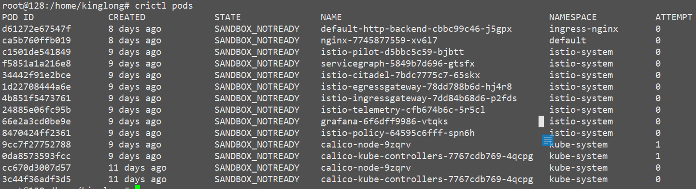
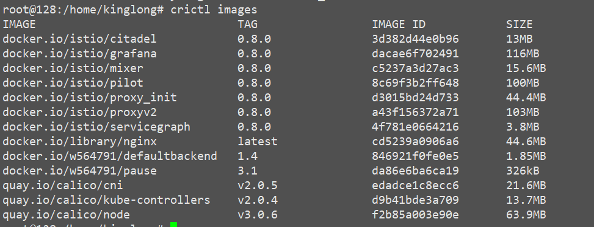

containerd 下载地址 [https://github.com/containerd/containerd/releases/download/v1.1.0/containerd-1.1.0.linux-amd64.tar.gz](https://github.com/containerd/containerd/releases/download/v1.1.0/containerd-1.1.0.linux-amd64.tar.gz)

`crictl`工具下载地址: [https://github.com/kubernetes-incubator/cri-tools/releases/download/v1.0.0-beta.1/crictl-v1.0.0-beta.1-linux-amd64.tar.gz](https://github.com/kubernetes-incubator/cri-tools/releases/download/v1.0.0-beta.1/crictl-v1.0.0-beta.1-linux-amd64.tar.gz)

kubelet配置

```
# /lib/systemd/system/kubelet.service
[Unit]
Description=Kubernetes Kubelet Server
Documentation=https://github.com/GoogleCloudPlatform/kubernetes
#After=docker.service
#Requires=docker.service
[Service]
WorkingDirectory=/var/lib/kubelet
ExecStart=/bin/kubelet \
--address=192.168.178.128 \
--hostname-override=192.168.178.128 \
--node-labels=node-role.kubernetes.io/k8s-node=true \
--image-gc-high-threshold=70 \
--image-gc-low-threshold=50 \
--port=10250 \
--network-plugin=cni \
--pod-infra-container-image=docker.io/w564791/pause:3.1 \
--cluster-dns=10.254.0.2 --cluster-domain=cluster.local.  \
--fail-swap-on=false \
--cgroup-driver=cgroupfs \
--bootstrap-kubeconfig=/etc/kubernetes/bootstrap.kubeconfig \
--kubeconfig=/etc/kubernetes/kubelet.kubeconfig \
--cert-dir=/etc/kubernetes/ssl \
--hairpin-mode promiscuous-bridge \
--serialize-image-pulls=false  \
--allow-privileged=true \
--logtostderr=false --log-dir=/var/log/k8s  \
--v=2 \
--runtime-cgroups=/system.slice/containerd.service --container-runtime=remote \ # here 
--runtime-request-timeout=15m --container-runtime-endpoint=unix:///run/containerd/containerd.sock  # here 
Restart=on-failure
[Install]
WantedBy=multi-user.target
```

containerd配置

生成默认配置

```
# containerd config default > /etc/containerd/config.toml
```

修改默认配置文件:

```
sandbox_image = "docker.io/w564791/pause:3.1"
```

* containerd默认是去Google仓库拉镜像,所以在使用时,最后加上镜像仓库地址

containerd.service配置

```
[Unit]

[Service]
Type=simple
ExecStart=/bin/bash -c "GOMAXPROCS=$(nproc) /usr/local/bin/containerd"
Restart=always
[Install]
WantedBy=multi-user.target
```

使用crictl 命令



