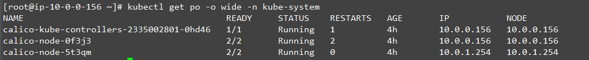
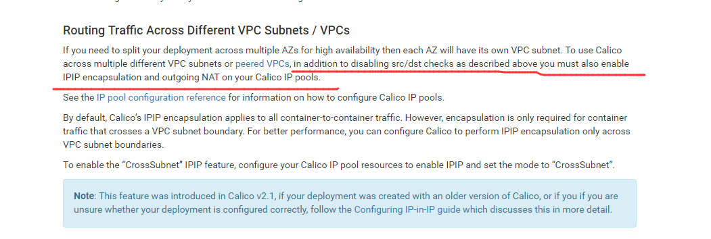
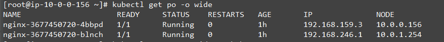
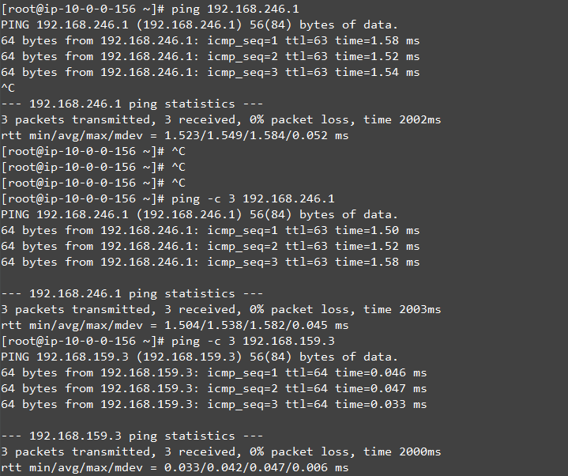
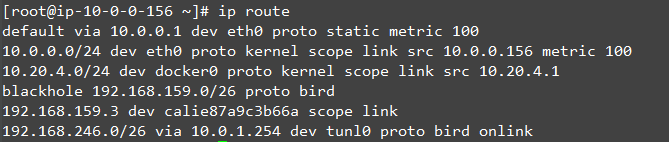

# 在kubernetes集群中部署calico

## Requirements

* kubelet必须配置为CNI \(e.g --network-plugin=cni\).
* kube-proxy 必须运行为iptables模式. 该模式从 Kubernetes v1.2.0.开始为默认模式
* kube-proxy 不能设置 --masquerade-all 参数, 与calico的策略冲突.
* Kubernetes NetworkPolicy API 需要Kubernetes v1.3.0以上.
* 当RBAC 启用时, 需要配置正确的role以及serviceaccount.

## [Calico Hosted Install](https://legacy.gitbook.com/book/w564791/kubernetes_gitbook/edit#)

kubernetes集群版本&gt;=v1.4时，使用此方法，Calico将运行为DaemonSet。本处使用（Calico Kubernetes Hosted Install）方法部署

### RBAC授权

```
kubectl apply -f https://docs.projectcalico.org/v3.0/getting-started/kubernetes/installation/rbac.yaml
```

## Install Calico

```
wget https://docs.projectcalico.org/v3.0/getting-started/kubernetes/installation/hosted/calico.yaml
```

编辑yaml文件，需要修改的内容如下：

    # Calico Version v3.0.4
    # https://docs.projectcalico.org/v3.0/releases#v3.0.4
    # This manifest includes the following component versions:
    #   calico/node:v3.0.4
    #   calico/cni:v2.0.3
    #   calico/kube-controllers:v2.0.2
    
    # This ConfigMap is used to configure a self-hosted Calico installation.
    kind: ConfigMap
    apiVersion: v1
    metadata:
      name: calico-config
      namespace: kube-system
    data:
      # Configure this with the location of your etcd cluster.
      etcd_endpoints: "https://10.0.0.156:2379" #etcd通信地址，注意通信协议
    
      # Configure the Calico backend to use.
      calico_backend: "bird"
    
    .......
    
      # If you're using TLS enabled etcd uncomment the following.
      # You must also populate the Secret below with these files.
      etcd_ca: "/calico-secrets/etcd-ca"   # "/calico-secrets/etcd-ca" 证书绝对路径
      etcd_cert: "/calico-secrets/etcd-cert" # "/calico-secrets/etcd-cert"
      etcd_key: "/calico-secrets/etcd-key"  # "/calico-secrets/etcd-key"
    
    ---


    apiVersion: v1
    kind: Secret
    type: Opaque
    metadata:
      name: calico-etcd-secrets
      namespace: kube-system
    data:
      # Populate the following files with etcd TLS configuration if desired, but leave blank if
      # not using TLS for etcd.
      # This self-hosted install expects three files with the following names.  The values
      # should be base64 encoded strings of the entire contents of each file.
      etcd-key: "" #证书内容base64编码 cat certificate|base64
      etcd-cert: ""#证书内容base64编码
    
      etcd-ca: ""#证书内容base64编码
    ---
    ..........
          containers:
            # Runs calico/node container on each Kubernetes node.  This
            # container programs network policy and routes on each
            # host.
            - name: calico-node
              image: quay.io/calico/node:v3.0.4
              env:
                # The location of the Calico etcd cluster.
                - name: ETCD_ENDPOINTS
                  valueFrom:
                    configMapKeyRef:
                      name: calico-config
                      key: etcd_endpoints
                # Choose the backend to use.
                - name: CALICO_NETWORKING_BACKEND
                  valueFrom:
                    configMapKeyRef:
                      name: calico-config
                      key: calico_backend
                # Cluster type to identify the deployment type
                - name: CLUSTER_TYPE
                  value: "k8s,bgp"
                # Disable file logging so `kubectl logs` works.
                - name: CALICO_DISABLE_FILE_LOGGING
                  value: "true"
                # Set noderef for node controller.
                - name: CALICO_K8S_NODE_REF
                  valueFrom:
                    fieldRef:
                      fieldPath: spec.nodeName
                # Set Felix endpoint to host default action to ACCEPT.
                - name: FELIX_DEFAULTENDPOINTTOHOSTACTION
                  value: "ACCEPT"
                # The default IPv4 pool to create on startup if none exists. Pod IPs will be
                # chosen from this range. Changing this value after installation will have
                # no effect. This should fall within `--cluster-cidr`.
                - name: CALICO_IPV4POOL_CIDR
                  value: "192.168.0.0/16" #此处需要修改为controller里配置的IP池
    ........

```
# kubectl create -f  calico.yaml
```



本例使用了aws云服务器，跨区域容灾，除了以上文档，还需要做额外配置。官方说明如下

操作方法如下：

1.删除已经存在的IP池（命令行工具需要额外下载）

```
# ./calicoctl delete ippool default-ipv4-ippool
```

2.新建IP池

```
# ./calicoctl apply -f - <<  EOF
   apiVersion: projectcalico.org/v3
   kind: IPPool
   metadata:
   name: ippool-ipip-1
   spec:
     cidr: 192.168.0.0/16
     ipipMode: Always
     natOutgoing: true
   EOF
```

## 测试：

```
# kubectl run nginx --image=nginx --replicas=2
```

ping测试



查看节点路由



## [Custom Installation](https://legacy.gitbook.com/book/w564791/kubernetes_gitbook/edit#)

除了使用kubernetes的DaemonSet方法运行，也可以使用ansible，chef，bash等办法。

（此处不介绍该方法）

