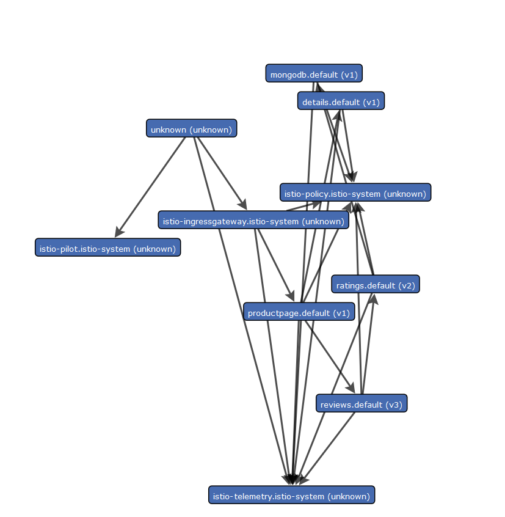

## 生成服务图

本次任务说明如何在istio网格中生成服务图,作为本次任务的一部分,我们会安装servicegraph插件并使用基于web的界面查看网格的服务图

## 在开始之前

- 正确安装istio
- 正确安装[bookinfo](https://istio.io/docs/guides/bookinfo/)示例程序

## 暴露servicegraph服务

1.使用nodePort暴露

```
# kubectl get svc -n istio-system servicegraph
NAME           TYPE       CLUSTER-IP     EXTERNAL-IP   PORT(S)         AGE
servicegraph   NodePort   10.254.35.68   <none>        8088:8088/TCP   10d

```

2.使用istio暴露服务

- `/force/forcegraph.html` 一个交互式的[D3.js](https://d3js.org/)  界面.
- `/dotviz` 静态的 [Graphviz](http://www.graphviz.org/) 可视化界面.
- `/dotgraph` 提供 [DOT](https://en.wikipedia.org/wiki/DOT) 序列化.
- `/d3graph`  为D3可视化提供JSON序列化 
- `/graph` 提供通用的JSON序列化 

```yaml
# istioctl get   virtualservice jaeger -o yaml
apiVersion: networking.istio.io/v1alpha3
kind: VirtualService
metadata:
  creationTimestamp: null
  name: jaeger
  namespace: default
  resourceVersion: "1150555"
spec:
  gateways:
  - bookinfo-gateway
  hosts:
  - jaeger.example.com
  http:
  - match:
    - uri:
        prefix: /force
    - uri:
        prefix: /dotviz
    - uri:
        prefix: /dotgraph
    - uri:
        prefix: /d3graph
    - uri:
        prefix: /graph
    - uri:
        prefix: /js
    route:
    - destination:
        host: servicegraph.istio-system.svc.cluster.local
        port:
          number: 8088

```

查询http://YOURDOMAIN/force/forcegraph.html,可以看到如下页面



通过查询参数,可以添加一定的过滤条件,请求<http://YOURDOMAIN/force/forcegraph.html?time_horizon=15s&filter_empty=true>   添加`filter_empty=true `参数,将会显示当前时间范围内的接收的流量服务,`time_horizon=15s`影响之前的过滤器,并且会影响查看时的流量报告信息

